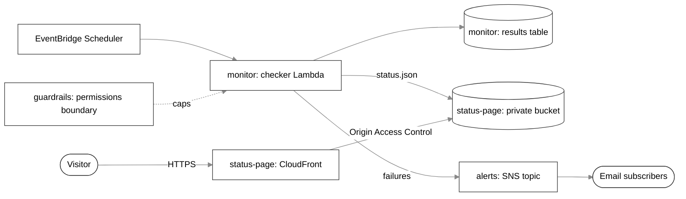

# terraform-aws-platform-modules

Reusable, tested Terraform modules for an uptime monitoring platform on AWS. Product teams consume these modules by version tag from a separate live infrastructure repository, so a change here only reaches an environment through a release and a reviewed version bump.

## Modules

| Module | Purpose |
|---|---|
| [`monitor`](modules/monitor) | Scheduled Lambda that checks URLs, records results in DynamoDB, writes the current status file, and publishes failures |
| [`alerts`](modules/alerts) | Encrypted SNS topic with email subscriptions and a policy that allows only listed publishers |
| [`status-page`](modules/status-page) | Private S3 bucket served through CloudFront with Origin Access Control |
| [`guardrails`](modules/guardrails) | Permissions boundary for workload roles and a monthly budget per environment |

## How the modules connect



## Using a module

Reference a module by Git tag. The double slash separates the repository from the folder inside it.

```hcl
module "monitor" {
  source = "git::https://github.com/drcampbell-92/terraform-aws-platform-modules.git//modules/monitor?ref=v1.0.0"

  name_prefix = "uptime-dev"
  targets = {
    homepage = "https://example.com"
  }
}
```

Pin an exact tag in every environment. Upgrading means changing the tag in a pull request.

## Versioning

Releases follow semantic versioning:

- **Major** (`v2.0.0`): a breaking change, such as a renamed or removed input.
- **Minor** (`v1.1.0`): a new feature that existing callers do not need to change for.
- **Patch** (`v1.0.1`): a fix with no interface change.

See [CHANGELOG.md](CHANGELOG.md) for what each release contains.

## Testing

Every module has a `tests` folder run by `terraform test` against a mock AWS provider. Tests need no AWS account and create nothing. They check naming standards, input validation, and least privilege in both directions: each permission is absent by default and tightly scoped when configured.

To run one module's tests:

```
cd modules/monitor
terraform init
terraform test
```

The pipeline in `.github/workflows/module-tests.yml` runs formatting, validation, and tests for every module on each pull request and on every push to `main`.

## Standards

- Every module uses the same layout: `main.tf`, `variables.tf`, `outputs.tf`, `versions.tf`, and `tests/`.
- Modules declare provider version ranges and never configure providers. Root configurations pin exact versions.
- The lock file is not committed here, because each consumer resolves its own providers.
- Resource names follow `<name_prefix>-<component>`, for example `uptime-dev-checker`.
- Policies are built with `jsonencode` so tests can inspect them.
